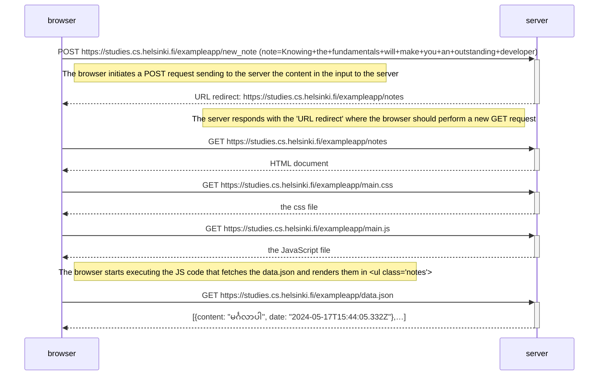

```mermaid
sequenceDiagram
    participant browser
    participant server
    
    browser->>+server: POST https://studies.cs.helsinki.fi/exampleapp/new_note (note=Knowing+the+fundamentals+will+make+you+an+outstanding+developer)
    Note right of browser: The browser initiates a POST request sending to the server the content in the input to the server
    server-->>-browser: URL redirect: https://studies.cs.helsinki.fi/exampleapp/notes
    Note left of server: The server responds with the 'URL redirect' where the browser should perform a new GET request
    
    browser->>+server: GET https://studies.cs.helsinki.fi/exampleapp/notes
    server-->>-browser: HTML document
    
    browser->>+server: GET https://studies.cs.helsinki.fi/exampleapp/main.css
    server-->>-browser: the css file
    
    browser->>+server: GET https://studies.cs.helsinki.fi/exampleapp/main.js
    server-->>-browser: the JavaScript file
    Note right of browser: The browser starts executing the JS code that fetches the data.json and renders them in <ul class="notes">
    
    browser->>+server: GET https://studies.cs.helsinki.fi/exampleapp/data.json
    server-->>-browser: [{content: "မင်္ဂလာပါ", date: "2024-05-17T15:44:05.332Z"},…]
```
